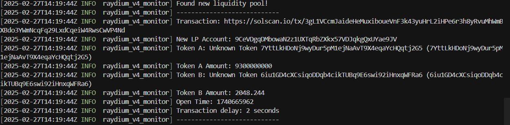

# Raydium V4 Monitor

## 简介 | Introduction

Raydium V4 Monitor 是一个用 Rust 编写的程序，用于监控 Solana 区块链上的 Raydium V4 流动性池创建事件。该项目旨在提供高效、可靠的交易监控解决方案。

Raydium V4 Monitor is a Rust-based program designed to monitor the creation of Raydium V4 liquidity pools on the Solana blockchain. This project aims to provide an efficient and reliable solution for transaction monitoring.

## 运行步骤 | How to Run

1. **安装 Rust 和 Cargo | Install Rust and Cargo**
   - 请确保已安装 Rust 和 Cargo。可以通过访问 [Rust 官网](https://www.rust-lang.org/) 获取安装指南。
   - Make sure Rust and Cargo are installed. Visit [Rust's official website](https://www.rust-lang.org/) for installation instructions.

2. **克隆项目 | Clone the Repository**
   - 使用以下命令克隆项目：
   - Clone the repository using the following command:
     ```bash
     git clone https://github.com/yourusername/raydium_v4_monitor.git
     cd raydium_v4_monitor
     ```

3. **配置 API 密钥 | Configure API Key**
   - 在 `src/main.rs` 中设置你的 Solana RPC API 密钥。
   - Set your Solana RPC API key in `src/main.rs`.

4. **运行程序 | Run the Program**
   - 使用 Cargo 运行程序：
   - Run the program using Cargo:
     ```bash
     cargo run
     ```

## 亮点 | Highlights

- **高效的交易处理 | Efficient Transaction Processing**
  - 使用 Rust 的并发特性，程序能够快速处理大量交易。
  - Leveraging Rust's concurrency features, the program can quickly process a large number of transactions.

- **可靠的错误处理 | Robust Error Handling**
  - 通过详细的日志记录和错误处理机制，确保程序的稳定性。
  - Ensures program stability through detailed logging and error handling mechanisms.

- **与 JavaScript 版本的对比 | Comparison with JavaScript Version**
  - **性能 | Performance**: Rust 提供了更高的性能和更低的延迟。
  - **安全性 | Safety**: Rust 的内存安全特性减少了潜在的错误。
  - **并发性 | Concurrency**: Rust 的异步编程模型使得并发处理更加高效。

## 贡献 | Contributing

欢迎提交问题和请求。我们欢迎社区的贡献！

Feel free to submit issues and pull requests. Contributions from the community are welcome!

## 许可证 | License

本项目采用 MIT 许可证。

This project is licensed under the MIT License.



